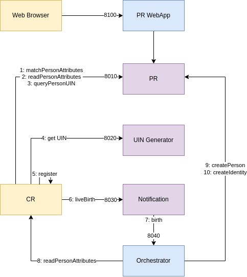

.. class:: center

|pic1| |pic2| |pic3|

Open Source reference implementation of OSIA in collaboration with X-Road and UNDP

Description
-----------

The use case for the reference implementation revolves around the efficient registration of newborns by the Civil Registry (CR)
and its synchronization with the Population Registry (PR). This collaborative effort between
the CR and PR ensures proper documentation and sets a solid foundation for the newborn's identity.

More information about this Use Case can be found `here <https://osia.readthedocs.io/en/v6.1.0/02%20-%20functional.html#birth-use-case>`_

To implement this Use Case the following building blocks are necessary:

- A Population Registry: UNDP provides DGIT as a possible Population Registry.
  The directory ``pr`` contains an implementation of the *PR* and *Data Access* interfaces.
- A UIN generator: the directory ``uin`` contains an implementation of the OSIA *UIN Management* interface.
- A notification service: the directory ``notification`` contains an implementation of the OSIA *notification* interface.
- An orchestrator: the directory ``orchestrator`` contains a service able to dispatch calls to OSIA interfaces in order to implement a Use Case.
- A Civil Registry: UNDP provides DGIT as a possible Civil Registry.

To secure the exchanges between the Civil Registry and the Population Registry, X-Road is used.
X-Road® is open-source software and ecosystem solution that provides unified and secure data exchange between organisations.
The source code is available in `GitHub <https://github.com/nordic-institute/X-Road/>`_.

All exchanges are compliant with OSIA specifications and are depicted in the following diagram:

Execution
---------

Technical details for executing this Use Case can be found in the ``demos`` directory.
