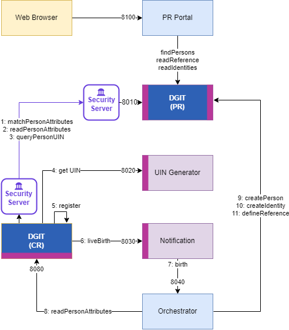

Open Source reference implementation for OSIA

Description
-----------

This project contains examples of OSIA implementation:

- ``pr-mock``: a Population Registry mock implementing some services from the *PR* and *Data Access* interfaces.
- ``uin``: implementation of the OSIA *UIN Management* interface
- ``notification``: implementation of the OSIA *notification* interface
- ``orchestrator``: a service able to dispatch calls to OSIA interfaces in order to implement a Use Case
- ``cr-mock``: a set of scripts to simulate a Civil Registry interacting with the different servers according to the birth use case.

Those servers implement the birth Use Case described in §2.3.1 of OSIA specification.
The following exchanges are implemented:

Execution
---------

Start the servers with::

    docker system prune -f
    docker-compose up --build --force-recreate

Start the CR clilent with::

    python3 -m venv .py
    source .py/bin/activate
    pip install -r requirements.txt
    # insert dummy data for the parents
    python insert_data.py
    # declare a new birth
    python cr_birth.py

