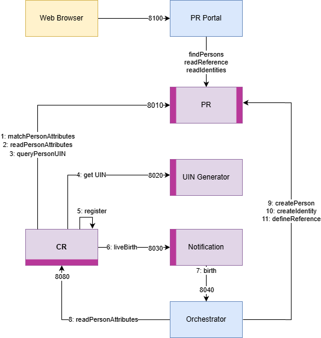

Birth Use Case
==============

Description
-----------

The use case for the reference implementation revolves around the efficient registration of newborns by the Civil Registry (CR)
and its synchronization with the Population Registry (PR). This collaborative effort between
the CR and PR ensures proper documentation and sets a solid foundation for the newborn's identity.

More information about this Use Case can be found `here <https://osia.readthedocs.io/en/v6.1.0/02%20-%20functional.html#birth-use-case>`_

To implement this Use Case the following building blocks are necessary:

- A Population Registry.
  The directory ``pr`` contains an implementation of the *PR* and *Data Access* interfaces suitable
  for testing this Use Case. Any other OSIA-compliant implementation can be used..
- A UIN generator: the directory ``uin`` contains an implementation of the OSIA *UIN Management* interface.
- A notification service: the directory ``notification`` contains an implementation of the OSIA *notification* interface.
- An orchestrator: the directory ``orchestrator`` contains a service able to dispatch calls to OSIA interfaces in order to implement a Use Case.
- A Civil Registry.
  The script ``cr_birth.py`` can be used to simulate a Civil Registry interacting with the different servers according to this use case.

All exchanges are compliant with OSIA specifications and are depicted in the following diagram:

Execution
---------

Start the servers with::

    docker system prune -f
    docker compose -f docker-compose.yml build --no-cache
    docker compose -f docker-compose.yml up --build --force-recreate

Start the CR client with::

    python3 -m venv .py
    source .py/bin/activate
    pip install -r requirements.txt
    # insert dummy data for the parents
    python insert_data.py
    # declare a new birth
    python cr_birth.py --fn babyname

Check the Population Registry content at http://localhost:8100/pr

Check the Grafana dashboard at http://localhost:3000. Login with admin/admin,
create a Prometheus data source pointing to http://prom:9090
and then import the dashboard in ``monitoring/OSIA.json``

Enroll for Birth
================

This Use Case is an extension of the previous Use Case. It is extended with:

- An OSIA-compliant enrollment station is used to enroll the child. The parent's identity
  is checked using the ABIS.
- An ABIS, used to validate the identity of the parent.
- A CMS. After the creation of the child's identity in PR, a new credential is requested.
  This credential can be pysical or digital.

